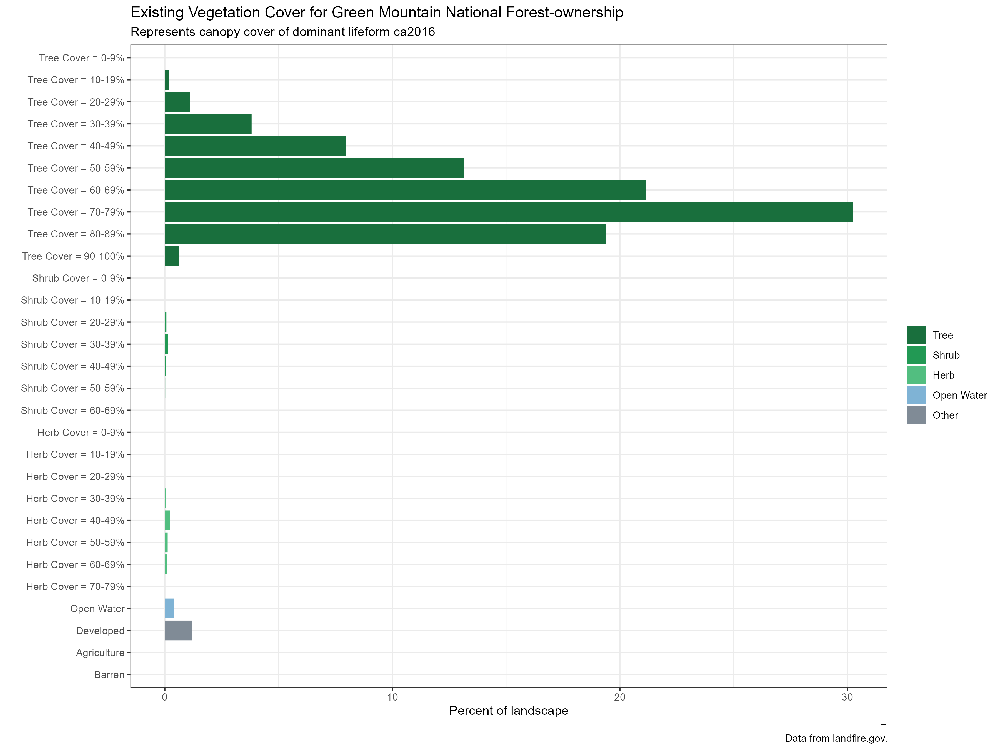
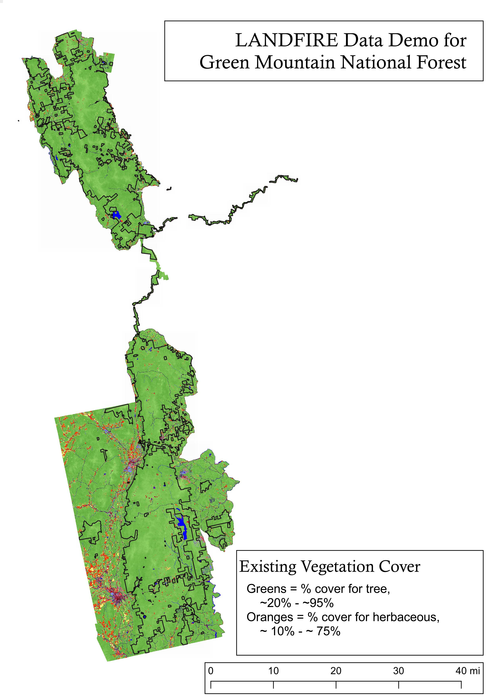

```{r setup, include=FALSE}
library(tufte)
library(tidyverse)
# invalidate cache when the tufte version changes
knitr::opts_chunk$set(echo = FALSE)
options(htmltools.dir.version = FALSE)
```


## Introduction and goals

This document showcases someLANDFIRE-powered maps and charts for the Green Mountain National Forest in Vermont. In general LANDFIRE enables an assessment of past and present ecosystems and their disturbances plus the ability to make comparisons.  LANDFIRE does not address climate change, or set "Desired Future Conditions". ^[exploring potential impacts of climate change and how management actions may or may not lead to desired future conditions may be accomplished using [SyncroSim](https://syncrosim.com/) and [TNC's modeling site](https://thenatureconservancy.github.io/landfiremodels/index.html) for more information.]  

Due to the name and major funding sources LANDFIRE is often thought of as a fire dataset.  While LANDFIRE does deliver many fire-focused datasets (e.g., the 40 Scott and Bergan Fire Behavior Fuel Models. Visit [here](https://landfire.gov/fbfm40.php)) for more information], this assessment is focused on the vegetation datasets.  

Additionally-this document is meant to be a conversation starter, and does not include the many possibilities brought to the table by NIACS for example. 

<br>
<br>

## A few characterisitics of LANDFIRE data and this report

LANDFIRE products are designed for use on large areas, typically comparing watersheds to watersheds for example. Often users ask "how small of an area can we use LANDFIRE data?" which is a tough question to answer as it varies based on data quality, heterogeneity of the vegetation (and underlying driving factors such as soils), and the particular dataset(s) being considered.  Further, the purpose of data use is of particular importance.  Using the data to explore trends is one thing, using LANDFIRE (or any data for that matter) to make place-specific decisions is another.  

```{r fig-margin, echo=FALSE, fig.cap="Schematic illustrating need for more review of data for smaller landscapes.", fig.height=3.5, fig.margin=TRUE, fig.width=3.5, message=FALSE, warning=FALSE, cache=TRUE}

```

LANDFIRE data has been successfully used for mid-scale planning (~10k acres), but that was after considerable review by experts.  To use data for smaller areas or for more detailed decision making requires more review per unit area (see graphic in sidebar). 

LANDFIRE spatial data is delivered in raster format with 30m pixel size.  Attribute tables can range from fairly simple (e.g., Existing Vegetation Cover), to rich with many fields (e.g., the Biophysical Settings data which includes historical fire regime information).  

This report was created using free data and software.  Data was downloaded from https://landfire.gov/getdata.php, all GIS processing and charts created in R^[[R](https://www.r-project.org/)], and all maps created in Quantum GIS^[[QGIS](https://www.qgis.org/en/site/)].

The report itself was written as an R-Markdown^[Learn more about r-markdown documents [here.](https://rmarkdown.rstudio.com/)] document.

It is not necessary to use these tools! One could just as easily use ESRI and Microsoft products. 


## Which ecosystems were dominant prior to European Colonization?

With climate change, invasive exotic species, resource extraction and other modern ecosystem drivers it can be difficult to develop a baseline, or understanding of what was on the landscape prior to European colonization.  LANDFIRE has a product suite under the Biophysical Settings (BpS)^[LANDFIRE defines Biophysical Settings as "the vegetation system that may have been dominant on the landscape prior to Euro-American settlement and is based on both the current biophysical environment and an approximation of the historical disturbance regime"] label that includes three components. The **BpS Descriptions**^[find yours at [here](https://landfirereview.org/search.php)] and accompanying **state-and-transition models**^[download from [this site](https://landfire.gov/bps-models.php)].  These documents and models describe how over 900 BpSs of the U.S. *looked and worked* historically.  Each one includes a description of the major succession classes, and estimated amounts of each succession class based on natural disturbance regimes. Learn more about these products and their development by reading [Blankenship et al. (2021)](https://esajournals.onlinelibrary.wiley.com/doi/pdf/10.1002/ecs2.3484). 

Also included are the **BpS spatial data**^[learn more [here](https://landfire.gov/bps.php)].  This raster data includes a robust attribute table with information on historical fire regimes in addition to multiple classifications of the BpSs (e.g., there are lumped schemes).  

<br>
<br>


**Green Mountain NF dominated by Northern Hardwood Forests historically**

Based on LANDFIRE BpS data three BpSs were present on over 90% of the landscape as shown in the chart and map below.  Both graphics are not complete-there are more BpSs mapped than indicated on both.  Lists were shortened for clarity, and to remove possible noise.  A complete list and mapped amounts are available from the author.  


<br>


```{r bpsChart, echo=FALSE, fig.fullwidth = TRUE, message=FALSE, warning=FALSE, cache=TRUE}

```

<br>

```{r bpsChart-ownership, echo=FALSE, fig.fullwidth = TRUE, message=FALSE, warning=FALSE, cache=TRUE}
knitr::include_graphics('assets/bpsChart-ownership.png')
```

<br>

Biophysical Settings Map, Proclamation Area with Ownership Boundary in black
<br>
```{r bpsMap, echo=FALSE,  out.width="80%", warning=FALSE, message=FALSE, cache=TRUE}
knitr::include_graphics('assets/bps.jpg')
```

<br>

Also possible with the BpS products:

* quantification of historical disturbance amounts per year, including different types of fire and wind/weather/stress 
* mapping of historical fire regimes
* delving into the state-and-transition models to explore and refine historical fire regimes to better match local knowledge, develop current condition models to document current disturbances and to modify to capture potential changes to disturbance regimes with climate change

In the last section of the document we will explore a couple ways to compare this historical data to current data.  

<br>


***

## Historical fire on the Green Mountain NF
The LANDFIRE Biophysical Settings spatial data includes modeled historical Mean Fire Return Intervals (MFRI) for surface, mixed, replacement and all fires.  By converting the MFRI to an annual probability (1/MFRI) then multiplying the annual probability by the acres of each BpS you can approximate the annual historical fire amounts.

```{r historical fire, echo=FALSE, message=FALSE, warning=FALSE,  fig.fullwidth = TRUE }

bpsMFRI10 <- read_csv("assets/bps_aoi_attributes.csv") %>%
   slice(-c(7, 24)) %>%
  top_n(n = 6, wt = rel_percent) %>%
  dplyr::select(4, 7:11) %>%
  pivot_longer(cols = 2:5,
               names_to = "fireType",
               values_to = "returnInterval") %>%
  mutate(annualProb = (1/returnInterval),
         annualAcres = (annualProb*acres)
         ) %>%
  arrange(desc(annualAcres))  %>%
  mutate(BPS_NAME = factor(BPS_NAME, levels = unique(BPS_NAME)))


annualFireChart <- bpsMFRI10 %>%
  ggplot(aes(fill=(fireType), 
             y=annualAcres, 
             x=BPS_NAME)) + 
  geom_col(width = 0.8, position = position_dodge()) +
  coord_flip() +
  labs(
    title = "Historical annual acres burned per BpS",
    subtitle = "Split out by fire type.  Top 6 BpSs by percent of Green Mountain NF shown",
    caption = "Data from landfire.gov.",
    x = "",
    y = "Acres")+
  theme_minimal(base_size = 8)+
  theme(plot.caption = element_text(hjust = 0, face= "italic"), #Default is hjust=1
        plot.title.position = "plot", #NEW parameter. Apply for subtitle too.
        plot.caption.position =  "plot") +
  scale_fill_manual(values = c("#AA3377" , #ALL
                               "#b57805", #MIXED
                               "#8a8978", #REPLACEMENT
                               "#d6d25c"), # SURFACE
                    name = "Fire Type", 
                    labels = c("All",
                               "Mixed",
                               "Replacement",
                              "Surface")) +
  theme_bw(base_size = 14)

annualFireChart

ggsave("assets/mfri.png", width = 12, height =8)


```
<br>

**Within the Ownership Boundary there was roughly 500 acres of fire per year prior to European Settlement**

<br>

```{r historical fire-ownership, echo=FALSE, message=FALSE, warning=FALSE,  fig.fullwidth = TRUE }

bpsMFRI10 <- read_csv("OUTPUTS/bps_aoi_attributes-ownership2.csv") %>%
   slice(-c(7, 24)) %>%
  top_n(n = 6, wt = rel_percent) %>%
  arrange(desc(rel_percent))  %>%
  dplyr::select(4, 7:11) %>%
  pivot_longer(cols = 2:5,
               names_to = "fireType",
               values_to = "returnInterval") %>%
  mutate(annualProb = (1/returnInterval),
         annualAcres = (annualProb*acres)
         )

annualFireChart <- bpsMFRI10 %>%
  ggplot(aes(fill=(fireType), y=annualAcres, x=reorder(BPS_NAME, annualAcres))) + 
  geom_col(width = 0.8, position = position_dodge()) +
  coord_flip() +
  labs(
    title = "Historical annual acres burned per BpS",
    subtitle = "Split out by fire type.  Top 6 BpSs by percent of Green Mountain NF (within ownership) shown",
    caption = "Data from landfire.gov.",
    x = "",
    y = "Acres")+
  theme_minimal(base_size = 8)+
  theme(plot.caption = element_text(hjust = 0, face= "italic"), #Default is hjust=1
        plot.title.position = "plot", #NEW parameter. Apply for subtitle too.
        plot.caption.position =  "plot") +
  scale_fill_manual(values = c("#AA3377" , #ALL
                               "#b57805", #MIXED
                               "#8a8978", #REPLACEMENT
                               "#d6d25c"), # SURFACE
                    name = "Fire Type", 
                    labels = c("All",
                               "Mixed",
                               "Replacement",
                              "Surface"))

annualFireChart


```


***

## What does the existing vegetation look like?

LANDFIRE delivers multiple datasets^[visit the [Vegetation page](https://landfire.gov/vegetation.php) to get more information] used to characterize current conditions.  Below are charts and maps of Existing Vegetation Type (EVT), Cover (EVC) and Height (EVH).

The EVT data represents conditions as of ca 2016.  This dataset is currently (January, 2022) to represent conditions as of ca2020.  Release data TBD. 

<br>
<br>


**Green Mountain NF dominated by Northern Hardwoods Forests as of ca2016**

Based on LANDFIRE EVT data there appears to be a loss of the swamp systems.  What is not clear from simply reviewing Bps and EVT data is an assessment of what converted to what.  Additionally, colors were not matched between the BpS and EVT maps.  Both graphics are not complete-there are more EVTs mapped than indicated on both.  Lists were shortened for clarity, and to remove possible noise.  A complete list and mapped amounts are available from the author.  


```{r evtChart, echo=FALSE,  fig.fullwidth = TRUE, message=FALSE, warning=FALSE, cache=TRUE}

```

<br>

```{r evtChart-ownership, echo=FALSE,  fig.fullwidth = TRUE, message=FALSE, warning=FALSE, cache=TRUE}

```

<br>

```{r evtMap, echo=FALSE,  out.width="80%", warning=FALSE, message=FALSE, cache=TRUE}
knitr::include_graphics('assets/evt.jpg')
```

<br>
<br>


**Green Mountain NF dominated by forests with relativity high canopy cover as of ca2016**

As expected most of the Green Mountain NF is mapped as the "forest" lifeform.  It appears that most of the landscape is in a closed canopy condition.

Note: the data is delivered in 1% increments.  In the graphics below the cover was categorized into 10% bins for viewing.  I am happy to share raw attribute tables for further review.  


```{r evcChart, echo=FALSE,  fig.fullwidth = TRUE, message=FALSE, warning=FALSE, cache=TRUE}
knitr::include_graphics('assets/evcclass_barplot.png')
```

<br>

```{r evcChart-ownership, echo=FALSE,  fig.fullwidth = TRUE, message=FALSE, warning=FALSE, cache=TRUE}

```

<br>

```{r evcMap, echo=FALSE,  out.width="80%", warning=FALSE, message=FALSE, cache=TRUE}

```

<br>
<br>


**Green Mountain NF dominated by forests with most pixels mapped between 15-20M as of ca2016**

As in the chart above most of the landscape is mapped as the "forest" lifeform.  LANDFIRE mapped most of the pixels as having an average height between 15-30M with a range of 3-38M.  

Note: the data is delivered in 1% increments.  In the graphics below the cover was categorized into bins (different for each lifeform) for viewing.  I am happy to share raw attribute tables for further review.  


```{r evhChart, echo=FALSE,  fig.fullwidth = TRUE, message=FALSE, warning=FALSE, cache=TRUE}
knitr::include_graphics('./OUTPUTS/evhclass_barplot.png')
```

<br>

```{r evhMap, echo=FALSE,  out.width="80%", warning=FALSE, message=FALSE, cache=TRUE}
knitr::include_graphics('assets/evh.jpg')
```
<br>


***

## Comparing historical and current vegetation

There are two main ways to compare historical with current vegetation conditions using LANDFIRE data:

1. Directly comparing the BpS and EVT data
2. Assessing over/under representation of succession classes^[aka structural stages of each BpS.  Learn more [here](https://landfire.gov/sclass.php)]

Below I present a couple ways to graphically represent these two types of comparisons.

<br>
<br>


**Comparing the BpS and EVT datasets**

In the BpS and EVT charts above it is possible to visually compare how *amounts* of different ecosystems have changed over time, but you cannot assess how a particular type has changed at a pixel by pixel level.  To do so requires doing a "stack" or "combine" of the BpS and EVT datasets so each pixel gets both a BpS label and an EVT label.  Once you have that in hand you can visualize the results in multiple ways.  One possibility is a sankey diagram such as the one included below.  Here I have **greatly** lumped vegetation types.  It is possible to create a more detailed sankey charts without the lumping.  Even with the lumping a few patterns emerge, for example a "conversion" of some of the Coniferous to Hardwoods.  


<br>

```{r sankey, echo=FALSE, message=FALSE, warning=FALSE, fig.height=9}
# load libraries

library(networkD3)
library(dplyr)
library(readr)


# read in snkyPdata
snkyPdata <- read_csv("OUTPUTS/forSankey.csv")

# define nodes
nodes <- data.frame(
         name=c(as.character(snkyPdata$source), 
         as.character(snkyPdata$target)) %>% 
          unique())

# add source and target fields
snkyPdata$IDsource <- match(snkyPdata$source, nodes$name)-1 
snkyPdata$IDtarget <- match(snkyPdata$target, nodes$name)-1

# Make the Network
snkyP2 <- sankeyNetwork(Links = snkyPdata, 
                       Nodes = nodes,
                       Source = "IDsource", 
                       Target = "IDtarget",
                       Value = "value", 
                       NodeID = "name", 
                       width = 1500,
                       height = 600, 
                       fontSize=22,
                       iterations = 0,
                       sinksRight=FALSE,
                       margin = 1)

snkyP2
```

<br>


**Comparing the succession classes within particular BpSs**

Each BpS has descriptions and mapping rules for up to 5 succession classes.  These succession classes are largely defined by canopy cover and height, by some degree by composition.  Using results from the models we get a "Reference" or expected percentage of each s-class.  Using mapping we get the current percentages.  

The following chart represents reference and current percentages of succession classes for 3 selected BpSs (ones that were fairly dominant historically).


<br>

```{r bpsScls, echo=FALSE,   fig.fullwidth = TRUE, warning=FALSE, message=FALSE, cache=TRUE}
knitr::include_graphics('./OUTPUTS/bpsScls.png')
```
<br>


## Comparing LANDFIRE EVT and Vermont's Significant Natural Communities data**

The Vermont Agency of Natural Resources tracks the best examples of natural community types that were downloaded on 7 March 2022 from the [VT Open Geodata Portal](https://geodata.vermont.gov/datasets/77b908c02cf9425ab6ece36ae2fe67cd/explore?location=43.874850%2C-72.473400%2C8.38).  These most likely represent the best dataset by which to compare LANDFIRE EVT data.

To do so I did a "combine" in ArcGIS Pro (spatial analyst toolbox) of the Significant Natural Communities (SNC) and EVT data.  Due to data scale use issues, I filtered out the rarest 5% of the SNCs then the rarest 5% of the EVT data that was mapped to each SNC.  Below is a Sankey chart to visually compare the results, then the raw data table.


**Significant Natural Communities---------------------------------------------------LF Existing Vegetation Types (EVTs)**

```{r sncEvtSankey, echo=FALSE, message=FALSE, warning=FALSE, fig.align='left', fig.height=14}
# load libraries

library(networkD3)
library(dplyr)
library(readr)


# read in snkyPdata
snkyPdata <- read_csv("OUTPUTS/sncEvtSankey.csv")

# define nodes
nodes <- data.frame(
         name=c(as.character(snkyPdata$source), 
         as.character(snkyPdata$target)) %>% 
          unique())

# add source and target fields
snkyPdata$IDsource <- match(snkyPdata$source, nodes$name)-1 
snkyPdata$IDtarget <- match(snkyPdata$target, nodes$name)-1

# Make the Network
snkyP2 <- sankeyNetwork(Links = snkyPdata, 
                       Nodes = nodes,
                       Source = "IDsource", 
                       Target = "IDtarget",
                       Value = "value", 
                       NodeID = "name", 
                       width = 1500,
                       height = 600, 
                       fontSize=16,
                       iterations = 0,
                       sinksRight=FALSE,
                       margin = 1)

snkyP2
```


## Next steps

Look into fire-dependant and fire datasets. 

As noted it is possible to "combine" LANDFIRE with local datasets-this should be considered.

And finally, I have never seen The Green Mountain NF!  Review of all data needed before next steps are taken.


