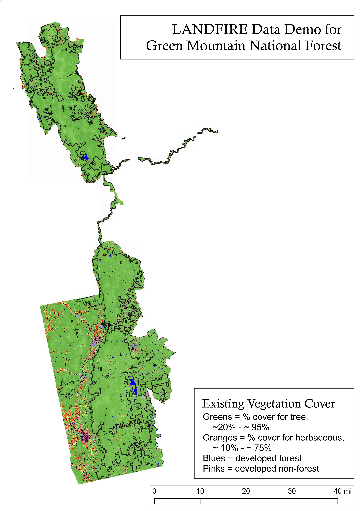

```{r packages, message=FALSE, warning=FALSE, include=FALSE}
library('tidyverse')
```


class: inverse, left, top

# Goals
- Present maps and summary charts of a subset of LANDFIRE datasets
- Link to processed spatial data, attribute tables and assets
- Provide basic interpretive information


 <iframe src="aoi_reference_map.html" width="80%" height="300"></iframe>

Boundary represents proclamation boundary which was obtained from Diane Burbank, Green Mountain and Finger Lakes National Forests GIS coordinator.  

---

class: inverse, left, top

# LANDFIRE

Federal partnership between the USDA Forest Service and US Department of Interior that "provides 20+ national geo-spatial layers (e.g. vegetation, fuel, disturbance, etc.), databases, and ecological models that are available to the public for the US and insular areas." (https://landfire.gov/)


```{r echo=FALSE, message=FALSE, warning=FALSE, fig.align='center', out.width="60%"}

```
<p style="text-align: center;">Prescribed fire on the Hiawatha National Forest, August 22, 2019.</p>

---
class: inverse, left, top

# LANDFIRE #2

Some characteristics of the data:
- Updates data periodically
- Datasets are free and cover all lands for the United States including insular islands
- Developed for large-scale analysis, planning and assessments

This presentation is a sample of the datasets and analysis that can be conducted.  Slides will be focused on proclamation area (ownership bounary will be in black on maps), however maps and charts for ownership area will be linked to on "Resources" slide.  

<br>

*The Nature Conservancy has a cooperative agreement to provide user support, science and to develop appropriate uses of LANDFIRE products.*

<br>

```{r echo=FALSE, message=FALSE, warning=FALSE, fig.align='center', out.width= "50%"}

```


---
class: inverse, left, top

# Pre-colonization Ecosystems


```{r echo=FALSE, message=FALSE, warning=FALSE, fig.align='center', out.height= "100%"}

```

---
class: inverse, left, top

# Pre-colonization Ecosystems


```{r echo=FALSE, message=FALSE, warning=FALSE, fig.align='center', out.width= "45%"}
knitr::include_graphics("assets/bps.jpg")
```

---
class: inverse, left, top

# Biophysical Settings notes

- ADD NOTES

Descriptions for all Biophysical Settings can be found by searching by name at https://landfirereview.org/search.php. Each BpS also has an accompanying state-and-transition model.   Please contact landfire@tnc.org, or Randy Swaty (rswaty@tnc.org) for more information. 

---

class: inverse, left, top

# Historical Fire Regimes-Southern GMNF


```{r echo=FALSE, message=FALSE, warning=FALSE, fig.align='center', out.width= "45%"}
knitr::include_graphics("assets/southMFRI.png")
```

---

class: inverse, left, top

# Historical Fire Regimes-Northern GMNF


```{r echo=FALSE, message=FALSE, warning=FALSE, fig.align='center', out.width= "45%"}
knitr::include_graphics("assets/northMFRI.png")
```

---
class: left, top

# Historical Fire Regimes by Ecosystem


```{r echo=FALSE, message=FALSE, warning=FALSE, fig.align='center', out.width=="100%"}
knitr::include_graphics("assets/mfri.png")
```

---
class: inverse, left, top
# Historical Fire Regimes Summary


---
class: inverse, left, top

# Existing Vegetation Type


```{r echo=FALSE, message=FALSE, warning=FALSE, fig.align='center'}
    knitr::include_graphics("assets/evtname_barplotTall.png")
```

---
class: inverse, left, top

# Existing Vegetation Type


```{r echo=FALSE, message=FALSE, warning=FALSE, fig.align='center', out.width= "45%"}

```


---
class: inverse, left, top

# Existing Vegetation Type notes

- ADD NOTES
 
More information on the EVT dataset available at https://landfire.gov/evt.php.  Descriptions of EVTs available at https://www.landfire.gov/documents/LANDFIRE_Ecological_Systems_Descriptions_CONUS.pdf.  
---
class: inverse, left, top

# Existing Vegetation Cover


```{r echo=FALSE, message=FALSE, warning=FALSE, fig.align='center', out.width= "85%"}
    knitr::include_graphics("assets/evcclass_barplot.png")
```

---
class: inverse, left, top

# Existing Vegetation Cover


```{r echo=FALSE, message=FALSE, warning=FALSE, fig.align='center', out.width= "45%"}
knitr::include_graphics("assets/evc.jpg")
```

---
class: inverse, left, top

# Existing Vegetation Cover notes

- ADD NOTES

More information on the Existing Vegetation Cover dataset can be found at https://www.landfire.gov/evc.php

---
class: inverse, left, top

# Existing Vegetation Height


```{r echo=FALSE, message=FALSE, warning=FALSE, fig.align='center', out.width= "85%"}
    knitr::include_graphics("assets/evhclass_barplot.png")
```

---
class: inverse, left, top

# Existing Vegetation Height

```{r echo=FALSE, message=FALSE, warning=FALSE, fig.align='center', out.width= "45%"}

```

---
class: inverse, left, top

# Existing Vegetation Height notes

- ADD NOTES

More information on the Existing Vegetation Height dataset can be found at https://www.landfire.gov/evh.php

---

class: left, top

# Past vs Present-one way to explore

```{r echo=FALSE, message=FALSE, warning=FALSE, fig.align='center', out.height='80%'}

knitr::include_graphics("assets/bpsScls.png")

```

---
class: inverse, left, top

# Past vs Present-notes

- ADD NOTES
    
*While looking at the past is illustrative, LANDFIRE past values do not necessarily represent "Desired Future Conditions".*


---
class: inverse, left, top

# Resources

- add link to proc maps and charts

 

