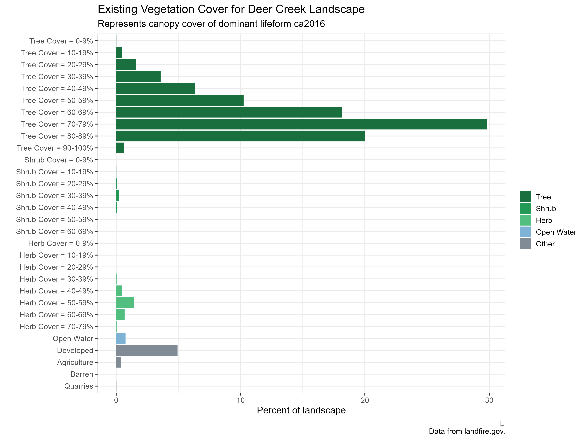

```{r packages, message=FALSE, warning=FALSE, include=FALSE}
library('tidyverse')
```


class: inverse, left, top

# Goals
- Present maps and summary charts of a subset of LANDFIRE datasets
- Link to processed spatial data, attribute tables and assets
- Provide basic interpretive information


 <iframe src="aoi_reference_map.html" width="80%" height="300"></iframe>

Boundary represents proclamation boundary which was obtained from Diane Burbank, Green Mountain and Finger Lakes National Forests GIS coordinator.  

---

class: inverse, left, top

# LANDFIRE

Federal partnership between the USDA Forest Service and US Department of Interior that "provides 20+ national geo-spatial layers (e.g. vegetation, fuel, disturbance, etc.), databases, and ecological models that are available to the public for the US and insular areas." (https://landfire.gov/)


```{r echo=FALSE, message=FALSE, warning=FALSE, fig.align='center', out.width="60%"}
knitr::include_graphics("assets/rxFire.jpg")
```
<p style="text-align: center;">Prescribed fire on the Hiawatha National Forest, August 22, 2019.</p>

---
class: inverse, left, top

# LANDFIRE #2

Some characteristics of the data:
- Updates data periodically
- Datasets are free and cover all lands for the United States including insular islands
- Developed for large-scale analysis, planning and assessments

This presentation is a sample of the datasets and analysis that can be conducted.  Slides will be focused on proclamation area (ownership bounary will be in black on maps), however maps and charts for ownership area will be linked to on "Resources" slide.  

<br>

*The Nature Conservancy has a cooperative agreement to provide user support, science and to develop appropriate uses of LANDFIRE products.*

<br>

```{r echo=FALSE, message=FALSE, warning=FALSE, fig.align='center', out.width= "50%"}
knitr::include_graphics("assets/logos.png")
```


---
class: inverse, left, top

# Pre-colonization Ecosystems-Background

LANDFIRE Maps a concept termed "Biophysical Settings" (BpS) which:

*represents the vegetation system that may have been dominant on the landscape prior to Euro-American settlement and is based on both the current biophysical environment and an approximation of the historical disturbance regime.*

from https://landfire.gov/bps.php

Each BpS has a mapped unit, a state-and-transition model and a description.  You can learn more about the descriptions and models at https://landfire.gov/bps-models.php 

---
class: inverse, left, top

# Pre-colonization Ecosystems


```{r echo=FALSE, message=FALSE, warning=FALSE, fig.align='center', out.height= "100%"}
knitr::include_graphics("assets/bpsChartTall.png")
```

---
class: inverse, left, top

# Pre-colonization Ecosystems Mapped


```{r echo=FALSE, message=FALSE, warning=FALSE, fig.align='center', out.width= "45%"}
knitr::include_graphics("assets/bps.jpg")
```

---
class: inverse, left, top

# Biophysical Settings notes

- The Green Mountain National Forest was dominated by BpSs with relatively long fire return intervals such as the Laurentian-Acadian (LA) Northern Hardwoods.
- There were notable fire-adapted BpSs such as the Central Appalachian (CA) Dry Oak-Pine Forest, and LA Northern Pine(-Oak) Forest.  
- BpSs with historical Mean Fire Return Intervals of less than 100 years added up to ~35k acres, or around 9% of the area.

<br>

<p style="text-align: center;">The BpS products feature information on historical fire regimes as depicted in the next slides</p>


---

class: inverse, left, top

# Historical Fire Regimes-Southern GMNF


```{r echo=FALSE, message=FALSE, warning=FALSE, fig.align='center', out.width= "45%"}
knitr::include_graphics("assets/southMFRI.png")
```

---

class: inverse, left, top

# Historical Fire Regimes-Northern GMNF


```{r echo=FALSE, message=FALSE, warning=FALSE, fig.align='center', out.width= "45%"}
knitr::include_graphics("assets/northMFRI.png")
```

---
class: left, top

# Historical Fire Regimes by Ecosystem


```{r echo=FALSE, message=FALSE, warning=FALSE, fig.align='center', out.width=="100%"}
knitr::include_graphics("assets/mfri.png")
```

---
class: inverse, left, top
# Historical Fire Regimes Summary

- Historically, LANDFIRE estimates there would have been ~3k acres of fire annually within the GMNF proclamation boundary
- Almost all of the fire would have been of the 'surface' type, occurring in the CA Dry Oak-Pine Forest BpS
- Some replacement fire was modeled in the LA Northern Hardwoods, but it would have been rare, with an almost 1k FRI
- Most of the fire occurred on the western side of the proclamation boundary, just outside of the ownership boundary. 

---

class: inverse, left, top

# Existing Vegetation Type-Background

- The Existing Vegetation Type (Cover and Height, EVT, EVC, EVH respectfully) datasets represent conditions on the ground as of 2016.  2020 data is currently in progress, suggesting a redo of this analysis late 2022/early 2023.
- The EVT data (from https://landfire.gov/evt.php):

**represents the current distribution of the terrestrial ecological systems classification, developed by NatureServe for the western hemisphere, through 2016**


<p style="text-align: center;">Note: the EVT dataset was created with different methods and slightly different legend than the BpS data.  Compare with caution.</p>


---
class: inverse, left, top

# Existing Vegetation Type


```{r echo=FALSE, message=FALSE, warning=FALSE, fig.align='center'}
    
```

---
class: inverse, left, top

# Existing Vegetation Type


```{r echo=FALSE, message=FALSE, warning=FALSE, fig.align='center', out.width= "45%"}
knitr::include_graphics("assets/evt.jpg")
```


---
class: inverse, left, top

# Existing Vegetation Type notes

- The dominant ecosystem mapped in the EVT data set was the LA Northern Hardwoods, followed by spruce-fir and pine-hemlock types.  
- Ecosystems with MFRIs of less than 100 years were mapped as occurring on less than 17k acres within the proclamation boundary. This is roughly 1/2 of what was mapped in the BpS dataset.  Note-this difference may be due to real changes on the landscape and/or differences in mapping methods.
- Roughly 80k acres within the proclamation boundary has been converted to non-natural land uses (e.g., urban and agriculture).
- The spruce-fir types increased from the BpS data, though representation is still limited to less than 10% of the area.  

---
class: inverse, left, top

# Existing Vegetation Cover


```{r echo=FALSE, message=FALSE, warning=FALSE, fig.align='center', out.width= "85%"}
    
```

---
class: inverse, left, top

# Existing Vegetation Cover


```{r echo=FALSE, message=FALSE, warning=FALSE, fig.align='center', out.width= "45%"}
knitr::include_graphics("assets/evc.jpg")
```


---
class: inverse, left, top

# Existing Vegetation Height


```{r echo=FALSE, message=FALSE, warning=FALSE, fig.align='center', out.width= "85%"}
    
```

---
class: inverse, left, top

# Existing Vegetation Height

```{r echo=FALSE, message=FALSE, warning=FALSE, fig.align='center', out.width= "45%"}
knitr::include_graphics("assets/evh.jpg")
```

---

class: inverse, left, top

# Existing Vegetation Cover and Height Summary

- Most vegetation mapped was "Tree", with the largest category of cover being 70-79% and height being 15-20M.
- Alone these datasets may have limited value; combined they have much more.  For example, these datasets plus the BpS dataset may be combined with rulesets from LANDFIRE to map 'succession classes' (structural stages). See next slide for example outputs.
- The LA Northern Hardwoods would have had substantial amounts of treed vegetation taller than 25M; these trees are mapped at very minor amounts in the EVH dataset. 

---

class: left, top

# Past vs Present-one way to explore

```{r echo=FALSE, message=FALSE, warning=FALSE, fig.align='center', out.width='90%'}


```

---
class: inverse, left, top

# Past vs Present-notes

*While looking at the past is illustrative, LANDFIRE past values do not necessarily represent "Desired Future Conditions".*

<br>

- Each BpS in the example chart has unique over and under representation of succession classes
- The LA Northern Hardwoods is largely missing the late-development, closed succession class, the Pine-Hemlock-Hardwood missing some of the early and mid classes.
- While the CA Dry Pine-Oak BpS is not widespread, it is an illustrative example of a fire-adapted ecosystem.  It is largely missing the late-open succession class.  


---
class: inverse, left, top

# Resources

- Raw input data located [here](https://github.com/rswaty/GreenMountainNF/tree/main/data)

 

